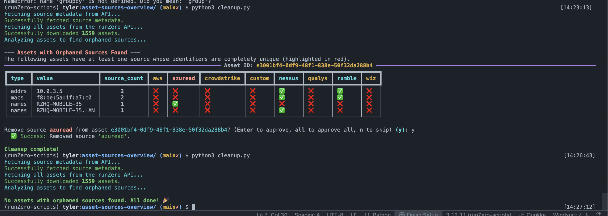

# Asset Sources Overview

This directory contains two Python scripts designed to analyze asset data from runZero and provide insights into how different sources contribute to your asset inventory. These scripts can help you identify "orphaned" sources—sources where all of an asset's identifiers are unique to that source—which can be a sign of stale or redundant data.

## Scripts

### `run-from-export.py`

This script is ideal for analysis and reporting. It processes a JSON export of your assets to generate a detailed report without making any changes to your runZero inventory.

**What it does:**

*   **Analyzes Local Data**: Reads asset information from a local `assets.json` file.
*   **Identifies Orphaned Sources**: Detects assets where one or more sources contribute only unique identifiers that are not shared by any other source for that asset.
*   **Generates Reports**:
    *   Prints a detailed breakdown for each asset to the console, highlighting which sources are considered orphaned.
    *   Creates a comprehensive `asset-source-report.csv` file showing every identifier for every asset and which sources it came from.
    *   Provides a runZero search query to easily find all assets with orphaned sources in your inventory.

**Usage:**

1.  **Export Assets**: Export your assets from the runZero Console in JSON format and save the file as `assets.json` in this directory.
2.  **Run the Script**:
    ```bash
    python run-from-export.py
    ```x

#### Sample output 


### `run-from-api-and-remove-sources.py`

This script is an interactive tool for both analyzing and cleaning up your asset data directly via the runZero API. It allows you to remove orphaned sources from assets one by one.

**What it does:**

*   **Fetches Live Data**: Connects to the runZero API to fetch your current asset inventory.
*   **Finds Orphaned Sources**: Analyzes assets to identify orphaned sources in the same way as the export script.
*   **Interactive Cleanup**: For each asset with an orphaned source, it displays a detailed table and prompts you to approve the removal of that source. You can choose to:
    *   Approve a single removal.
    *   Skip a removal.
    *   Approve all future removals in the session.
*   **Removes Sources**: If you approve, the script makes a DELETE request to the runZero API to remove the specified source from the asset.

**Usage:**

1.  **Set Environment Variable**: This script requires an organization-level API key. Set it as an environment variable:
    ```bash
    export RUNZERO_ORG_TOKEN="YOUR_API_KEY_HERE"
    ```
2.  **Run the Script**:
    ```bash
    python run-from-api-and-remove-sources.py
    ```

#### Sample output 

